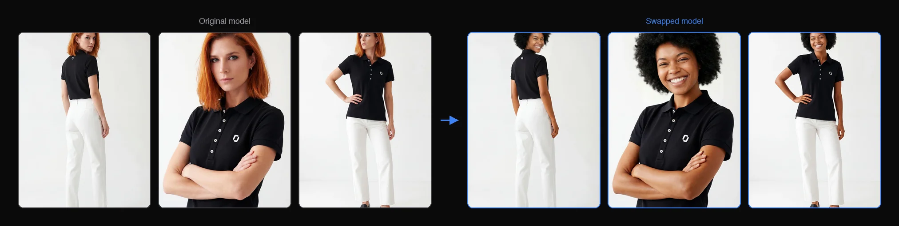

<p align="center">
  
  </br>
  <h3 align="center"><a href="https://on-model.com">Model Swap by PiktID</a></h3>
</p>

<p align="center">
  <b>Replace models in product photos while preserving every garment detail.</b>
  <br/>

</p>

<p align="center">
  
</p>

# Model Swap - v1.0
[](https://on-model.com)
[](https://app.on-model.com)
[](https://discord.com/invite/FJU39e9Z4P)

Model Swap implementation by PiktID for processing Product Detail Page (PDP) images. This script performs automated model-swap on multiple images in a folder using the <a href="https://v2.api.piktid.com">PiktID v2 API</a>.

## Why On-Model?

- **Garment preservation** — Pixel-perfect accuracy on textures, patterns, stitching, and fit. Your products always look exactly as they should.
- **50+ diverse AI identities** — Models spanning ages, genders, ethnicities, and body types (XS–XL). Or upload your own brand model.
- **Batch processing** — Process entire product catalogs with parallel workers. Scale from 10 SKUs to 10,000.
- **Full API access** — Automate image generation in your existing workflow, PIM system, or custom pipeline.
- **4K output** — Production-ready resolution for web, print, and advertising.

Built by PiktID — the team behind [Studio](https://studio.piktid.com) and EraseID, used by 300,000+ people for AI-powered image processing.

## About On-Model

[On-Model](https://on-model.com) is an AI-powered platform by PiktID designed for fashion e-commerce. It enables brands, retailers, and marketplaces to transform their product imagery at scale:

- **Model Swap** — Replace models in existing product photos while preserving garments exactly as they are
- **Flat-to-Model** — Convert flat-lay product photography into realistic on-model images
- **Identity Management** — Create and maintain consistent AI model identities across your entire catalog

Try the platform at [app.on-model.com](https://app.on-model.com) — **15 free images per month**, no credit card required.

## Getting Started

The following instructions suppose you have already installed a recent version of Python. For a general overview, please visit the <a href="https://docs.piktid.com/docs/v2">API documentation</a>.

> **Step 0** - Register at <a href="https://app.on-model.com">app.on-model.com</a>. 15 images are given for free to all new users every month. Then generate an API token from your [profile dashboard](https://app.on-model.com/profile?tab=tokens).

> **Step 1** - Clone the Model Swap repository
```bash
# Installation commands
$ git clone https://github.com/piktid/model-swap.git
$ cd model-swap
$ pip install requests
```

> **Step 2** - Prepare your PDP folder with images

Ensure your input folder contains Product Detail Page images (JPG, JPEG, or PNG format). The script automatically filters out images that don't contain models:
- Images with `_INTERNAL_` in the filename are excluded
- Images with `_NONMODEL_` in the filename are excluded

> **Step 3** - Choose your identity

You can either use an existing identity code from your gallery or upload a new identity image:

**Option A: Using an existing identity code**
```bash
$ python model_swap.py \
  --input-folder PDP/ARTICLE123 \
  --token YOUR_API_TOKEN \
  --identity-code PiktidSummer \
  --output-folder results/ARTICLE123
```

**Option B: Uploading a new identity image**
```bash
$ python model_swap.py \
  --input-folder PDP/ARTICLE123 \
  --token YOUR_API_TOKEN \
  --identity-image identities/female/LisaSummer.jpg \
  --output-folder results/ARTICLE123
```

> **Step 4** - Monitor the processing

The script will automatically:
1. Authenticate with the API
2. Upload all PDP images from the input folder
3. Create a project (or reuse an existing one)
4. Upload or verify the identity
5. Create a model-swap job
6. Monitor job progress
7. Download results to the output folder

You'll see progress updates in the console. Once complete, processed images will be saved to your output folder.

> **Step 5** - Review results

Results are saved to the output folder with the following structure:
```
output/
├── image1_v0.jpg          # Processed image (version 0)
├── image2_v0.jpg          # Processed image (version 0)
├── image3_v0.jpg          # Processed image (version 0)
└── metadata.json          # Complete job information and results
```

The `metadata.json` file contains:
- Job ID and status
- Processing results for each image
- Quality scores and processing times
- Image URLs and metadata

## API Flow

The script follows this sequence of API calls:

All requests are authenticated with a Bearer token (generated from your [profile dashboard](https://app.on-model.com/profile?tab=tokens)) in the `Authorization` header.

```
1. POST /upload             -> Get pre-signed S3 URL + file_id (per image)
2. PUT  <upload_url>        -> Upload image binary to S3
3. POST /project            -> Create project (get project_id)
4. GET  /identity/<code>    -> Verify identity exists
   or POST /identity/upload -> Upload new identity image
5. POST /model-swap         -> Submit job with project_id + file_ids + identity_code
6. GET  /jobs/<id>/status   -> Poll until status = "completed"
7. GET  /jobs/<id>/results  -> Fetch output images (CloudFront URLs)
```

## Post-Processing

If you want to enable post-processing (skin equalization) for better results:
```bash
$ python model_swap.py \
  --input-folder PDP/ARTICLE123 \
  --token YOUR_API_TOKEN \
  --identity-code PiktidSummer \
  --output-folder results/ARTICLE123 \
  --post-process
```

## Advanced: choosing a generation model

On-Model runs model-swap through PiktID's proprietary **Onda** engine by default. You can route a job to Google's **Nano Banana Pro** instead with the `--model` flag:

```bash
$ python model_swap.py \
  --input-folder PDP/ARTICLE123 \
  --token YOUR_API_TOKEN \
  --identity-code PiktidSummer \
  --model nano_banana_pro
```

Accepted values: `auto` (default, uses Onda), `onda`, `nano_banana_pro`.

Every entry in the job results response carries a `model_used` field indicating which engine actually produced that image. The script prints it alongside each downloaded file (e.g. `Downloaded: img_001_v0.jpg (model: onda)`), and the raw value is preserved in `metadata.json`.

## Command Line Options

```
--input-folder      Path to folder containing PDP images (required)
--token             API token (required) — generate at https://app.on-model.com/profile?tab=tokens
--identity-code     Existing identity code to use (optional)
--identity-image    Path to identity image file to upload (optional)
--output-folder     Output folder for results (default: output)
--base-url          API base URL (default: https://v2.api.piktid.com)
--post-process      Enable post-processing (default: False)
--model             Generation engine: auto | onda | nano_banana_pro (default: auto)
```

**Note:** Either `--identity-code` or `--identity-image` must be provided.

## Usage Examples

### Example 1: Basic Processing

Process a PDP folder with an existing identity code:
```bash
$ python model_swap.py \
  --input-folder PDP/P1KT1D-Y22 \
  --token YOUR_API_TOKEN \
  --identity-code PiktidSummer \
  --output-folder output/P1KT1D-Y22
```

### Example 2: Upload New Identity

Upload a new identity and process images:
```bash
$ python model_swap.py \
  --input-folder PDP/P1KT1D-Y22 \
  --token YOUR_API_TOKEN \
  --identity-image identities/female/LisaSummer.jpg \
  --output-folder output/P1KT1D-Y22
```

### Example 3: With Post-Processing

Enable post-processing (skin equalization):
```bash
$ python model_swap.py \
  --input-folder PDP/P1KT1D-Y22 \
  --token YOUR_API_TOKEN \
  --identity-code PiktidSummer \
  --output-folder output/P1KT1D-Y22 \
  --post-process
```

## Batch Processing (Parallel)

For processing multiple PDP folders at once, use `batch_swap.py`. It runs multiple `ModelSwap` instances in parallel using a thread pool, with each worker handling a complete independent workflow.

### Process all subfolders in a directory

```bash
$ python batch_swap.py \
  --input-dir PDP/ \
  --token YOUR_API_TOKEN \
  --identity-code PiktidSummer \
  --output-dir results/
```

This scans `PDP/` for subfolders and processes each one as a separate job. Results are saved to `results/<folder-name>/`.

### Process specific folders

```bash
$ python batch_swap.py \
  --input-folders PDP/ARTICLE1 PDP/ARTICLE2 PDP/ARTICLE3 \
  --token YOUR_API_TOKEN \
  --identity-image identities/female/LisaSummer.jpg \
  --output-dir results/ \
  --parallel 5
```

### Batch Command Line Options

```
--input-dir         Directory containing PDP subfolders (mutually exclusive with --input-folders)
--input-folders     Specific PDP folder paths to process (mutually exclusive with --input-dir)
--token             API token (required) — generate at https://app.on-model.com/profile?tab=tokens
--identity-code     Existing identity code to use (optional)
--identity-image    Path to identity image file to upload (optional)
--output-dir        Base output directory (default: output)
--base-url          API base URL (default: https://v2.api.piktid.com)
--post-process      Enable post-processing (default: False)
--parallel          Number of parallel workers (default: 3, max: 5)
```

Parallelism is capped at 5 to respect the API rate limit (5 requests/minute on `/model-swap`). The built-in retry mechanism handles any 429 responses that occur when jobs are submitted close together.

A JSON summary file is saved to the output directory after each batch run with timing and success/failure details for every folder.

## Rate Limiting and Resilience

The script includes built-in handling for API rate limits:

- **Rate limiting (429):** All API calls automatically retry with exponential backoff (1s, 2s, 4s, 8s, 16s) plus random jitter, up to 5 retries per request
- **Token expiry (401):** If your token has expired, the script will print an error. Generate a new token at [app.on-model.com/profile?tab=tokens](https://app.on-model.com/profile?tab=tokens).

The `/model-swap` endpoint is rate-limited to **5 requests per minute**. The retry mechanism handles this transparently.

## Troubleshooting

### Authentication Failed
```
Token expired or invalid
```
**Solution:** Generate a new API token at [app.on-model.com/profile?tab=tokens](https://app.on-model.com/profile?tab=tokens). Tokens can be set to expire up to 4 years from issuance.

### No Images Found
```
No processable images found in PDP/ARTICLE123
```
**Solution:**
- Verify the input folder path is correct
- Check that the folder contains image files (JPG, JPEG, PNG)
- Note: Images with `_INTERNAL_` or `_NONMODEL_` in filenames are automatically excluded

### Identity Not Found
```
Error checking identity: ...
```
**Solution:**
- Verify the identity code exists in your gallery at [app.on-model.com](https://app.on-model.com)
- Or provide an `--identity-image` path to upload a new identity

### Rate Limited
```
Rate limited (429). Waiting 2.1s before retry 1/5...
```
This is normal behavior. The script automatically retries with increasing delays. If you see "Max retries exceeded", wait a minute and try again.

### Job Timeout
```
Timeout: Job took longer than 1200 seconds
```
**Solution:** The job may be taking longer than expected. Check the API server status. You can modify the `max_wait_time` parameter in the `wait_for_job` method if needed.

### Connection Errors
```
Authentication error: Connection refused
```
**Solution:**
- Verify the API server is running
- Check the `--base-url` is correct
- Ensure network connectivity to the API server

## Error Handling

The script will exit with an error code if:
- Authentication fails
- No images are found in the input folder
- Identity upload/verification fails
- Job creation fails
- Job does not complete successfully
- Results download fails
- Rate limit retries are exhausted

Check the console output for detailed error messages.

## Links

- [On-Model Website](https://on-model.com) — Learn about the platform
- [On-Model App](https://app.on-model.com) — Try the app (15 free images/month)
- [Flat-to-Model Repo](https://github.com/piktid/flat-to-model) — Sister repo for flat-lay to on-model
- [API Documentation](https://docs.piktid.com/docs/v2) — Full API reference
- [PiktID](https://piktid.com) — Company website
- [Discord](https://discord.com/invite/FJU39e9Z4P) — Community and support

## Contact
office@piktid.com
